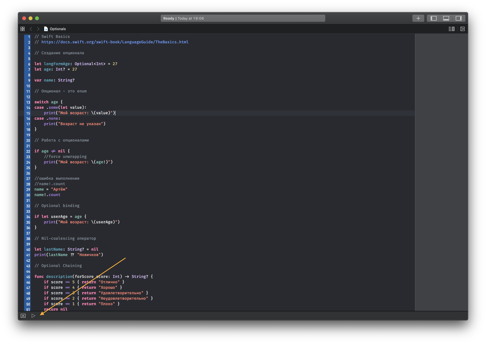

## Как запустить

1. Установить последнюю версию [Xcode](https://apps.apple.com/ru/app/xcode/id497799835)

2. Скачать и разархивировать [проект](https://github.com/artemnovichkov/optionals/archive/master.zip)

3. Открыть файл Optionals.playground

4. Запустить, как показано на скриншоте:

   

     
   

